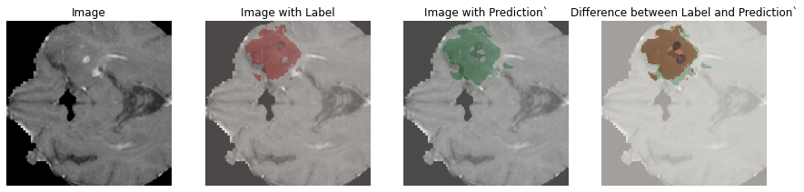
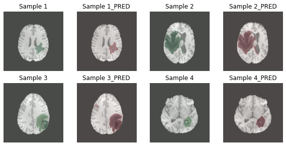

# BraTs20
Brain Tumor Segmentation, 두뇌 ct 영상 내 Tumor segmentation을 진행합니다.  
알고리즘은 3D Unet, 2D Unet을 적용하여 진행하였습니다.  
[Challenge Site : BraTs20](https://www.med.upenn.edu/cbica/brats2020/data.html)

## BraTs20 Data Info
- Data Format : nii.gz  
- Image  
    1. T1 : native
    2. T1CE : post_contrast
    3. T2 : T2-weighted
    4. Flair : T2 Fluid Attenuated Inversion Recovery 
- Labels
    1. Label 0 : Unlabeled Volumn
    2. Label 1 : Necrotic and non-enhancing tumor core (NCR / NET)
    3. Label 2 : Peritumoral Edema (ED)
    4. Label 3 : missing ( No pixels in all the volumnes contain label 3)
    5. Label 4 : GD-enhancing tumor (ET) 
 
## Model
- Performance  
    3D UNET : Mean IoU = 0.8143  
    2D UNET : Dice_coeff = 1.20 (Multiclass label into Singleclass)

## Results  
- 3D UNET  
    

- 2D UNET  
    
